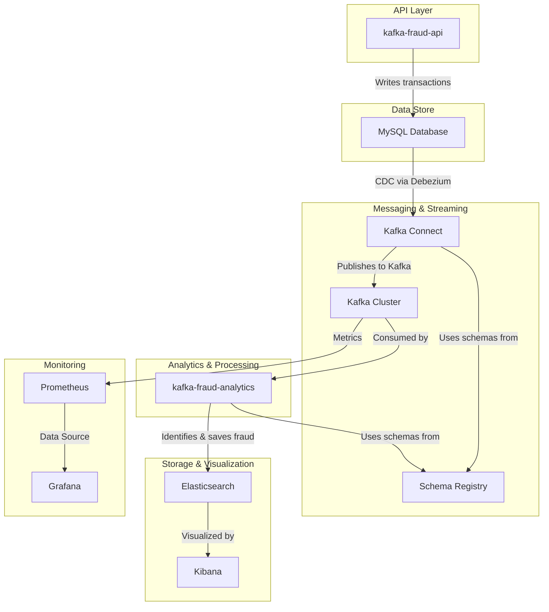

# Real-Time Fraud Detection System with Kafka

This document provides a systematic narrative of the real-time fraud detection system, covering its architecture, data flow, and the role of each component.

## 1. System Architecture

The system is designed as a distributed, event-driven architecture using Docker for containerization and orchestration. The architecture consists of several interconnected components that work together to process, analyze, and visualize transaction data in real-time.

The core components of the system are:

*   **Data Source**: A MySQL database that stores transaction data.
*   **Messaging System**: A Kafka cluster that acts as the central nervous system, enabling asynchronous communication between components.
*   **Data Ingestion**: Debezium, running on Kafka Connect, captures changes from the MySQL database and streams them to Kafka.
*   **Stream Processing**: A Spring Boot application (`kafka-fraud-analytics`) that consumes transaction data from Kafka, applies fraud detection logic, and performs real-time aggregations using Kafka Streams.
*   **Data Sink**: Elasticsearch is used to store and index fraudulent transactions for analysis and visualization.
*   **API Layer**: A Spring Boot application (`kafka-fraud-api`) provides an endpoint to generate mock transaction data.
*   **Monitoring & Visualization**: A monitoring stack composed of Prometheus and Grafana is used to monitor the health and performance of the Kafka cluster. Kibana is used to visualize the data stored in Elasticsearch.

The following diagram illustrates the high-level architecture of the system:

## 2. Data Flow

The data flow in the system is designed to be unidirectional and event-driven, ensuring loose coupling and scalability.

1.  **Transaction Creation**: The process begins when the `kafka-fraud-api` application generates mock transactions and saves them to the `transactions` table in the MySQL database.

2.  **Change Data Capture (CDC)**: The Debezium MySQL connector, running on Kafka Connect, continuously monitors the MySQL binary log for any changes (inserts, updates, deletes) in the `transactions` table.

3.  **Publishing to Kafka**: Upon detecting a change, Debezium captures the data, converts it into an Avro message, and publishes it to the `mysql.fraud.transactions` Kafka topic. The Avro schema for the messages is automatically registered with the Schema Registry.

4.  **Real-time Processing**: The `kafka-fraud-analytics` application consumes the transaction messages from the `mysql.fraud.transactions` topic in real-time.

5.  **Fraud Detection**: For each transaction, the `FraudCheckerService` applies a simple rule: if the transaction amount exceeds 10,000,000, it is considered fraudulent.

6.  **Storing Fraudulent Transactions**: When a fraudulent transaction is detected, it is saved to the `fraud_transactions` table in the database and also indexed in Elasticsearch via the Elasticsearch Sink Connector, which consumes from the same `mysql.fraud.transactions` topic.

7.  **Stream Aggregation**: The `TransactionPerMinuteStream` uses Kafka Streams to calculate the total number of transactions per minute. The results are published to the `transactions-per-minute` Kafka topic.

8.  **Visualization**: Kibana is connected to Elasticsearch, allowing for the visualization and analysis of fraudulent transactions. Grafana is connected to Prometheus to visualize the metrics of the Kafka cluster.

## 3. Component Explanation

### 3.1. kafka-fraud-api

*   **Description**: A Spring Boot application that provides a REST API to generate mock transaction data.
*   **Role**: It serves as the entry point for data into the system. The `GET /transactions/mock` endpoint triggers the creation of a specified number of transactions, which are then inserted into the MySQL database.

### 3.2. kafka-fraud-analytics

*   **Description**: A Spring Boot application that contains the core fraud detection and stream processing logic.
*   **Role**:
    *   **`TransactionConsumer`**: Consumes transactions from Kafka.
    *   **`FraudCheckerService`**: Implements the business logic for identifying fraudulent transactions.
    *   **`TransactionPerMinuteStream`**: A Kafka Streams application that performs real-time aggregations on the transaction data.

### 3.3. MySQL

*   **Description**: An open-source relational database.
*   **Role**: It acts as the primary data store for transactions.

### 3.4. Kafka Cluster

*   **Description**: A distributed streaming platform.
*   **Role**: It serves as the central backbone of the system, decoupling data producers from data consumers and enabling real-time data streaming.

### 3.5. Kafka Connect

*   **Description**: A framework for connecting Kafka with external systems.
*   **Role**: It hosts the Debezium MySQL connector for sourcing data from MySQL and the Elasticsearch Sink Connector for sending data to Elasticsearch.

### 3.6. Debezium

*   **Description**: A distributed platform for Change Data Capture (CDC).
*   **Role**: It captures row-level changes in the MySQL database and publishes them to Kafka in a structured format.

### 3.7. Schema Registry

*   **Description**: A centralized repository for Avro schemas.
*   **Role**: It ensures data consistency across the platform by managing the schemas of the data flowing through Kafka.

### 3.8. Elasticsearch

*   **Description**: A distributed search and analytics engine.
*   **Role**: It stores and indexes fraudulent transactions, enabling fast search and analysis.

### 3.9. Kibana

*   **Description**: A data visualization and exploration tool for Elasticsearch.
*   **Role**: It provides a user interface to query, visualize, and analyze the fraudulent transaction data stored in Elasticsearch.

### 3.10. Prometheus & Grafana

*   **Description**: An open-source monitoring and alerting toolkit (Prometheus) and a visualization platform (Grafana).
*   **Role**: They provide a comprehensive monitoring solution for the Kafka cluster, allowing for the tracking of key metrics such as message throughput, latency, and broker health.
